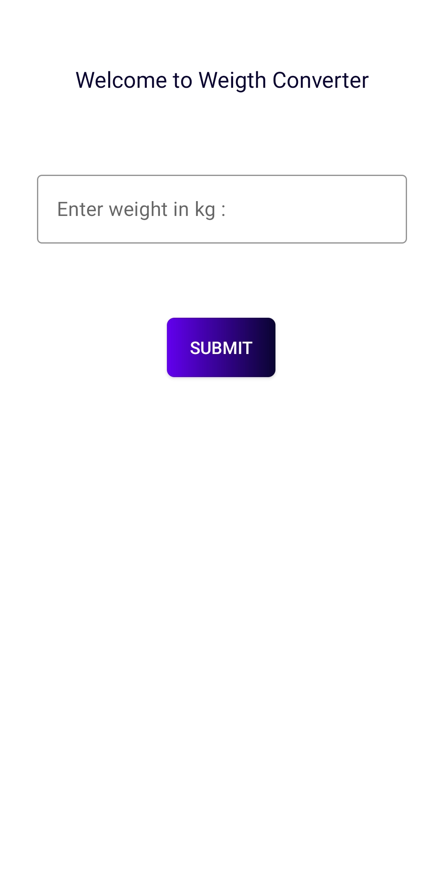

# Weight Converter 

Here I have made an app using **Java**. 

It is a *Weight Converting App* where the user will give their weight in **kg** and will get their weight in **_Pounds_** 

1. You need to install Android Studion from [here](https://www.python.org/downloads/)
3. And the total Requirements is full filled.

### Important Instructions :

* The User has to give some data in term of weight.

Reference Code : 
```python
int kg = Integer.parseInt(s);

double pound = 2.205 * kg;

Toast.makeText(MainActivity.this, "Your Weight in pound is " + pound + ".", Toast.LENGTH_SHORT).show();
```

Reference Images : <br>
	<br>

This is the README file for Weight Converter repository. [^1]

[^1]: By : Vivek Padia.
